I see other students in my research group struggling and spending weeks trying to replicate experiments that have already been done and for which the code is already available. And I ask myself, what could we do to make it better for them and other researchers? It should be as easy as "just run the experiment program", right? But even when code is available and runnable, significant friction remains.

## But, why does it matter if someone can run your research code easily?

Reproducibility, the ability to repeat an experiment, given its code and obtain the same results, is vital to scientific construction. Following Popper's line of thought <d-cite key="KarlPopperStanford"></d-cite>, science depends on hypotheses and statements that can be tested and falsified. Without reproducibility, such testing becomes difficult for critical argumentation, which weakens scientific claims, even if it does not directly invalidate them.

Today, there is a "reproducibility crisis" in science <d-cite key="baker1500ScientistsLift2016"></d-cite>. Interestingly, physicists and engineers are among those who say their work is more reproducible, while more than 60% have had problems reproducing others' experiments. This contradiction highlights a clear reproducibility problem that impacts the quality of the scientific knowledge generated, while its causes may not be as clear. One possible reason for this is over-reliance on computers, which scientists see as precise entities that execute "precise" algorithms, but whose reproducibility ultimately depends on their proper execution of those programs <d-cite key="plesserReproducibilityVsReplicability2018"></d-cite>. From another perspective, the pressure to publish ranks second among the causes of irreproducibility, diminishing the quality of scientific code and its usability.

There are initiatives to improve the issue of reproducibility. The "AI4Europe Reproducibility Initiative" <d-cite key="AI4EuropeReproducibilityInitiative"></d-cite> focuses on three different barriers to reproducibility: technical, the documentation and preservation of software and data; cultural, the encouragement and valuation of reproducibility over results and novelty alone; and systemic, the lack of standards and guidelines for reproducibility. Conferences also address the issue, with ICLR incentivizing a reproducibility statement <d-cite key="ICLR2026Author"></d-cite> and NeurIPS <d-cite key="NeurIPS2025Call"></d-cite> including a mandatory reproducibility question in its checklist. There are even awards for studies that best address reproducibility <d-cite key="GENEAWorkshop2025"></d-cite>. NeurIPS also suggests using the Papers With Code guidelines <d-cite key="PaperswithcodeReleasingresearchcode2025"></d-cite>, which include requirements such as a requirements list, Docker images uploaded to Docker Hub, separate code for training and evaluation, pre-trained models, and instructions for reproducing the results. As outlined in this guideline, not only the code but also sharing other artifacts are essential, as one can say, "Where re-running is successful, the published artifacts allow others to build on earlier work" <d-cite key="plesserReproducibilityVsReplicability2018"></d-cite>.

However, we argue that reproducibility alone is not enough for science. Science is about questioning and proposing new perspectives and approaches, about advancing the SotA. It's not enough to simply be able to re-execute and understand a project. It needs to be possible to use it and build upon it, because that's how science is built. Often, "reproducible" code is a black box that runs in a Docker container, spits out a number, and dies. If I can't dissect the model to understand _why_ it worked, that's performance validation, not knowledge building. And the current view, focused solely on the reproducibility crisis, fails to see this resulting gap. When we ask our students to replicate an experiment published by other researchers, we want them to understand it and be able to propose changes and new approaches based on it.

We have a proliferation of "single-use codes," and that is not sustainable. Symptoms of the trap of prioritizing productivity over quality and scientific advancement include shortcuts to publishing quickly that, paradoxically, ultimately increase the overall time cost of science. Ultimately, we are creating a **"scientific debt"** that makes research more challenging. We have separated the code for a new method here from the code of the experiment performed to validate it, since the former should be the focus of this problem. Methods should be reusable and extensible, as significant advances in science have not been built upon single-use methods.

## Pillars for Scientific Computing Science

Building on the "scientific debt" presented, we propose to view the problem from three pillars, **Reproducibility**, **Legibility**, and **Composability**:

| **Reproducibility**                                                                                                       | **Readability**                                                                                                                                      | **Composability**                                                                                                        |
| ------------------------------------------------------------------------------------------------------------------------- | ---------------------------------------------------------------------------------------------------------------------------------------------------- | ------------------------------------------------------------------------------------------------------------------------ |
| The classical reproducibility view, which focuses on the ability to re-run an experiment, which we have discussed so far. | The ability to interpret a project, understand how it works, and know how to use it. It's about making a project transparent, no longer a black box. | The possibility of creating something new using existing code. Being able to use SotA methods to advance science further. |

As mentioned, reproducibility is essential to the validity of science and the foundation of its quality; without it, the other pillars are useless. Readability, on the other hand, advances the field and enables a proper understanding of what is happening; without it, it becomes challenging to use previous results. Finally, composability is what most contributes to advancing science and should be the objective when designing research software.

## From Scripts to Building Blocks: A Path Forward

Let's look at practical actions we can take to achieve the pillars. We will focus on scientific code written in Python, as it is the most widely used language in science today. We will include links to tutorials, tools, and specifications that may be useful.

These are some recommendations that you, as a researcher, can use. But even though well-intentioned researchers can make incredible things; this is a problem we also need to address collectively, as we will discuss later.

1. **Software design**

	We need software with designs considering the division of concerns. Currently, it's very common to see programs that mix the code of the proposed method (method code) with the code of the experiment that validates the method and generates metrics and results (experiment code). 
	
	Ideally, these codes should be decoupled, allowing the method to be reused in future research. The method code should also, whenever possible, be written using well-known, widely used frameworks, further increasing compatibility. Think about how easy it is to use a neural network layer that is already written in a ready-to-use PyTorch class. The experiment code should contain not only the code to run the experiment, but also its configurations and the code responsible for processing datasets. Furthermore, it should include clear execution entry points, avoiding the need to run different scripts in different folders to perform a single task, such as training or evaluating a model.
	
2. **Code standards**

	A consistent coding style throughout the project is important for ease of understanding. Writing variable, function, and class names in a way that clearly explains what they do is a good starting point.

	Some practices make code significantly easier to understand—for example, avoiding very long functions or files, keeping imports at the top of each file, and reducing the use of large configuration dictionaries passed through the code.
	
	There are tools, like AutoPEP8 <d-cite key="Autopep8ToolThat"></d-cite><d-cite key="Autopep8VisualStudio"></d-cite> and SonarLint <d-cite key="SonarQubeIDEVisual"></d-cite>, which can help maintain a consistent, appropriate style.

3. **Documentation**
   
	In addition to following good coding standards, it's important to write clear documentation alongside the code that explains what each section of code does. This can include comments in more complex areas and, at least, function docstrings. Type annotations <d-cite key="TypeHintsPython21"></d-cite><d-cite key="TypingSupportType"></d-cite> are also part of this group; in addition to being used by functions for auto-completion of parts of docstrings, they also facilitate code usage by allowing autocomplete and visualization of the appropriate documentation while writing new code.

4. **Version control**

	Versioning your project helps future researchers find the specific version associated with a published result. It also facilitates collaborative development among different researchers and makes explicit the changes made over time.

	Version control should be applied to the codebase, but you can also use it for other artifacts, such as pre-trained models, Docker images, and datasets. Tools like git/GitHub for code, and Zenodo for other artifacts, make it easier to make artifacts available through versions.
	
5. **Publishing and distribution**
   
	Publishing your research software on a standard, user-friendly channel helps other researchers utilize your contribution in future research. In Python, this usually means packaging your method and distributing it using PyPI (Python Package Index) <d-cite key="PythonPackageIndex"></d-cite><d-cite key="PackagingPythonProjects"></d-cite>.

	Avoid expecting other researchers to copy your script into their projects. Besides being less straightforward, it doesn't consider potential future versions and complicates issues like licensing. Imagine including the license for each library you used in your research in your repository.

6. **Dependencies specification**

	Specifying all the dependencies of your project is a first step in enabling a third party to reproduce your results or use your method.
	
	When distributing your method, avoid specifying fixed versions, as this will make it difficult to use with other packages. Specify the minimum versions your project supports. And use standard ways to specify dependencies, such as your project's pyproject.toml file <d-cite key="WritingYourPyprojecttoml"></d-cite>.

7. **Hardware specification**

	Specify what hardware you used to run your experiment, as well as the minimum requirements your method may need. This helps other researchers prepare environments to reproduce your results and further develop them.

8. **Containerization**

	Docker <d-cite key="WhatContainer0200"></d-cite>, like other container tools, allows other researchers to use the environment you used to conduct your experiments directly. This makes it much easier to reproduce your results and use your method, since all dependencies will be identical to yours. In addition to making the dockerfile you created for your image available, also consider making your built image available on Docker Hub <d-cite key="DockerHubContainer"></d-cite> or Zenodo <d-cite key="PauleveDonodoBridging"></d-cite>.

9.  **Tutorials**

	Write tutorials about your method. Besides providing a quick, straightforward introduction that can serve as a first overview and gateway to more in-depth publications, it helps others get started using your method. Jupyter Notebook <d-cite key="grangerJupyterThinkingStorytelling2021"></d-cite><d-cite key="ProjectJupyter"></d-cite> is a suitable format for tutorials.

10. **Licensing**

	It's pointless to make your project available if others can't use it due to legal issues. Licensing is an integral part of allowing your method to be explored by other researchers. Several licenses, with different properties, are available. Please choose the one that best suits your project and use it correctly <d-cite key="ChooseOpenSource"></d-cite>.

	Remember that making code available without any license means being stuck in a limbo between "nobody can use it" and the contradiction of "I made it available on a platform like GitHub". And there are specific licenses for each type of artifact. In particular, Creative Commons <d-cite key="CreativeCommons"></d-cite> licenses are not appropriate for code <d-cite key="CreativeCommonsFrequentlyAskedQuestions"></d-cite>.
	
11. **Persistence and traceability**

	Make your code and artifacts available in persistent repositories. Zenodo is a good example that automatically stores releases from GitHub repositories <d-cite key="ZenodoGitHubSoftware"></d-cite>. 
	
	Also consider how these repositories can be found in the future. Referencing the DOI of these artifacts can facilitate their traceability in the future. For code on GitHub, consider making CFF files available with the project's DOI <d-cite key="CITATIONFiles"></d-cite>.

Let's see how each indication relates to the pillars. Notice how reproducibility and composability are often closely related in practice:

```mermaid
%%{init: { "gantt": { "displayMode": "compact", "leftPadding":200 } }}%%
gantt
    title     ​ 
    dateFormat  X
    axisFormat  
    
    section ​
	    Reproducibility :active, rerun, 1, 2
	    Readability :active, read, 2, 3
	    Composability :active, comp, 3, 4

    section 1. Software design
	    ​  : a1, 3,4
	    
	section 2. Code standards
	    ​  : a2, 2,3
	    
	section 3. Documentation
	    ​  : a3, 2,3
	    
	section 4. Version control
	    ​  : a4, 1,2
		​  : a4-2, 3,4
		    
	section 5. Publishing and distribution
	    ​  : a5, 1,2
	    ​  : a5-2, 3,4    
	    
	section 6. Dependencies specification
	    ​  : a6, 1,2
		​  : a6-2, 3,4	

	section 7. Hardware specification
	    ​  : a7, 1,2
		​  : a7-2, 3,4	    
	    
	section 8. Containerization
	    ​  : a8, 1,2
	    ​  : a8-2, 3,4
	    
	section 9. Tutorials
		​  : a9, 3,4

	section 10. Licensing
		​  : a10, 3,4

	section 11. Persistence and traceability
	    ​  : a11, 1,2
		​  : a11-2, 3,4	   
```

## Last Remarks

Many of the recommendations mentioned resemble software engineering processes. This is because, let's not forget, scientific research software is still... software. Ensuring its quality also involves elements similar to those in any other software.

But even given the limits of reproducibility, it's pointless to raise our quality standards for computer science research if we can't address this scientific debt crisis. Cultural barriers, where a lack of incentives and increasing pressure on results and publications are a significant reason why we can't solve these problems <d-cite key="AI4EuropeReproducibilityInitiative"></d-cite>. This is where major conferences, such as the ICLR, journals, and funding agencies can step in by highlighting the importance of a sustainable scientific ecosystem that enables efficient future research and by explicitly demanding actions to achieve this goal.

